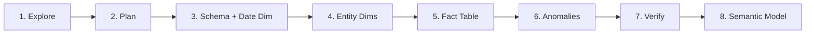

# synth-data

Generate production-realistic synthetic star-schema datasets on Snowflake — with proper statistical distributions, regional seasonality, and anomaly injection — for demos, testing, and PoCs.

---

## What It Does

**synth-data** is a [Cortex Code](https://docs.snowflake.com/en/user-guide/cortex-code/cortex-code) skill that generates complete star-schema datasets directly in your Snowflake account. Unlike random data generators that produce uniform noise, it creates statistically realistic data using:

- **ZIPF power-law distributions** for revenue and spend (the 80/20 rule)
- **NORMAL distributions** for natural metrics (lengths of stay, basket sizes)
- **Regional holiday calendars** driving seasonal volume spikes and dips
- **Configurable anomaly injection** for testing detection and alerting pipelines

The result is a fully populated fact table with dimension tables, surrogate keys, referential integrity, and distributions that look like real production data when you chart them.

---

## Key Features

| Category | Detail |
|----------|--------|
| Use cases | 120 pre-defined schemas across 12 industry verticals |
| Regions | 26 regional profiles with holidays, seasonality curves, and currency |
| Distributions | ZIPF (revenue), NORMAL (natural metrics), Pattern #11 (categoricals) |
| Seasonality | Monthly activity indices + holiday multipliers (compound-stacked) |
| Anomalies | Positive outliers (flash sales, viral events) and negative (outages, dips) |
| Output modes | `live` (execute directly on Snowflake) or `sql_files` (portable .sql scripts) |
| Scale | Small (10K), Medium (100K), Large (1M) fact rows |
| Verification | Gini coefficient, FK integrity checks, seasonality spot-checks |
| Semantic model | Optional Cortex Analyst YAML generation for natural language querying |

---

## Supported Verticals

Each vertical includes 10 use cases with pre-defined star schemas, distribution parameters, and seasonality patterns.

| Vertical | Example Use Cases |
|----------|-------------------|
| Healthcare | Patient 360, Claims Analytics & Fraud Detection, Readmission Risk, Revenue Cycle Optimization |
| Retail & CPG | Customer 360, Demand Forecasting, Price Optimization, Supply Chain Visibility |
| Financial Services | Fraud Detection, AML/KYC, Credit Risk, Market Risk & Portfolio Analytics |
| Insurance | Claims Analytics & Fraud, Underwriting Automation, Catastrophe Modeling, Pricing & Rate Adequacy |
| Technology / SaaS | Product-Led Growth, Usage-Based Billing, Revenue Intelligence (ARR/MRR), Customer Health & Churn |
| Manufacturing | Predictive Maintenance, Quality Analytics, OEE Optimization, Digital Twin & Process Optimization |
| Telecom | Customer 360, Churn Prediction, Network Performance, 5G Monetization & Network Slicing |
| Energy & Utilities | Grid Reliability, Demand Forecasting, Smart Meter Analytics, EV Load Impact |
| Logistics & Transportation | Route Optimization, Fleet Utilization, Shipment Visibility, Last-Mile Delivery |
| Media & Entertainment | Content Recommendation, Ad Yield, Viewer Engagement, Rights & Royalty Management |
| Life Sciences & Pharma | Clinical Trial Optimization, Pharmacovigilance, RWE Analytics, Drug Supply Chain |
| Public Sector | Constituent Service, Fraud/Waste/Abuse, Public Safety, Budget Forecasting |

---

## Supported Regions

**Americas**: `us`, `ca`, `latam-mexico`, `latam-brazil`, `latam-chile`, `latam-argentina`, `latam-colombia`, `latam-peru`, `latam-panama`, `latam-costa-rica`, `latam-ecuador`, `latam-bolivia`, `latam-uruguay`, `latam-paraguay`, `latam-guatemala`, `latam-el-salvador`, `latam-honduras`, `latam-venezuela`, `latam-dominican-republic`, `latam-puerto-rico`, `latam-cuba`

**Europe**: `eu-west`

**Asia-Pacific**: `apac-japan`, `apac-india`, `apac-australia`

**Middle East & Africa**: `mena-uae`

Each region includes: holiday calendar with volume/value multipliers, monthly activity index (12 values), default currency, fiscal year convention, and business hours.

---

## How It Works



1. **Explore** — Validates inputs, checks privileges, loads schema map and region parameters
2. **Plan** — Derives table structure, row counts, and distributions; presents cost estimate for approval
3. **Schema + Date Dim** — Creates the target schema and a date dimension with holiday flags
4. **Entity Dimensions** — Generates dimension tables with ZIPF-distributed tiers and geographic weighting
5. **Fact Table** — Builds the fact table with time-series composition, seasonal multipliers, and FK assignment
6. **Anomalies** — Injects detectable outlier events and data quality artifacts
7. **Verify** — Validates distributions (Gini), referential integrity, and seasonal patterns
8. **Semantic Model** (optional) — Generates a Cortex Analyst YAML for natural language querying

The skill pauses for user confirmation at key checkpoints (after the plan, before dropping existing schemas).

---

## Installation

Copy this repository into your Cortex Code plugins directory:

```bash
cp -r synth-data ~/.snowflake/cortex/plugins/synth-data
```

Or clone directly:

```bash
git clone https://github.com/sfc-gh-pmonteiro/synth-data.git ~/.snowflake/cortex/plugins/synth-data
```

The skill will be available immediately in Cortex Code Desktop.

---

## Usage

Invoke the skill by describing what you need in the Cortex Code chat. Examples:

**Generate retail data for a US demo:**
> Generate a retail customer-360 dataset for the US market, medium scale, in DEMO_DB.RETAIL_SYNTH

**Create healthcare claims data as SQL files:**
> Create synthetic healthcare claims data for Brazil, small scale, output as SQL files to ./synth_output/claims_br

**SaaS metrics for a product analytics PoC:**
> I need a SaaS product-led growth dataset, large scale, for eu-west in ANALYTICS_DB.PLG_DEMO

The skill will guide you through parameter confirmation, present a generation plan with cost estimates, and execute after your approval.

---

## Output Modes

### `live` — Execute directly on Snowflake

Requires an active Snowflake connection with CREATE TABLE privileges. Runs all SQL directly, validates results at each phase, and delivers a data dictionary + rollback script.

### `sql_files` — Portable SQL scripts

No Snowflake connection required. Generates numbered `.sql` files for later execution:

```
{output_dir}/
├── 00_setup.sql            -- CREATE DATABASE/SCHEMA, USE statements
├── 01_dim_date.sql         -- Date dimension + holiday calendar
├── 02_dim_{entity1}.sql    -- First entity dimension
├── 03_dim_{entity2}.sql    -- Additional dimensions
├── 04_fact_{name}.sql      -- Fact table generation
├── 05_anomalies.sql        -- Anomaly/data quality injection
├── 06_verify.sql           -- All validation queries
├── 99_rollback.sql         -- DROP SCHEMA CASCADE
└── README.md               -- Data dictionary
```

---

## Requirements

- **Snowflake account** with CREATE TABLE privileges on the target schema
- **Cortex Code Desktop** (the skill runs inside the IDE chat)
- **Warehouse**: X-SMALL for small scale, SMALL for medium, MEDIUM+ for large

| Scale | Fact Rows | Recommended Warehouse | Est. Credits |
|-------|-----------|----------------------|--------------|
| small | ~10K | X-SMALL | < 0.01 |
| medium | ~100K | SMALL | ~0.05 |
| large | ~1M | MEDIUM | ~0.3 |

---

## Repository Structure

```
synth-data/
├── SKILL.md                                  -- Skill specification (operational prompt)
├── README.md                                 -- This file
├── LICENSE                                   -- MIT License
└── references/
    ├── SYNTH_SQL_PATTERNS.md                 -- 14 reusable SQL generation patterns
    ├── SYNTH_REGIONS.md                      -- 26 regional parameter sets
    └── SYNTH_USE_CASE_SCHEMA_MAP.md          -- 120 use case → schema mappings
```

| File | Purpose |
|------|---------|
| `SKILL.md` | The full skill specification — phases, guardrails, patterns, and verification checklist |
| `references/SYNTH_SQL_PATTERNS.md` | 14 composable SQL patterns (ZIPF, NORMAL, time-series, Gini, etc.) |
| `references/SYNTH_REGIONS.md` | Holiday calendars, monthly activity indices, and business conventions per region |
| `references/SYNTH_USE_CASE_SCHEMA_MAP.md` | Complete schema definitions for all 120 use cases |

---

## License

[MIT](LICENSE)
